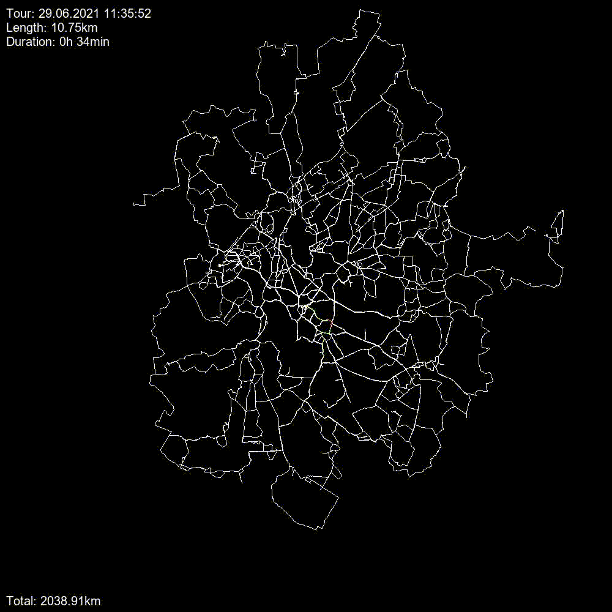

# GPX Visualizer

This simple projects visualizes gpx tracks and shows GPS data over time.
I used python together with [PIL(Pillow)](https://pypi.org/project/Pillow/) to draw the individual images and [gpxpy](https://pypi.org/project/gpxpy/) along with pandas to read the gpx files.
